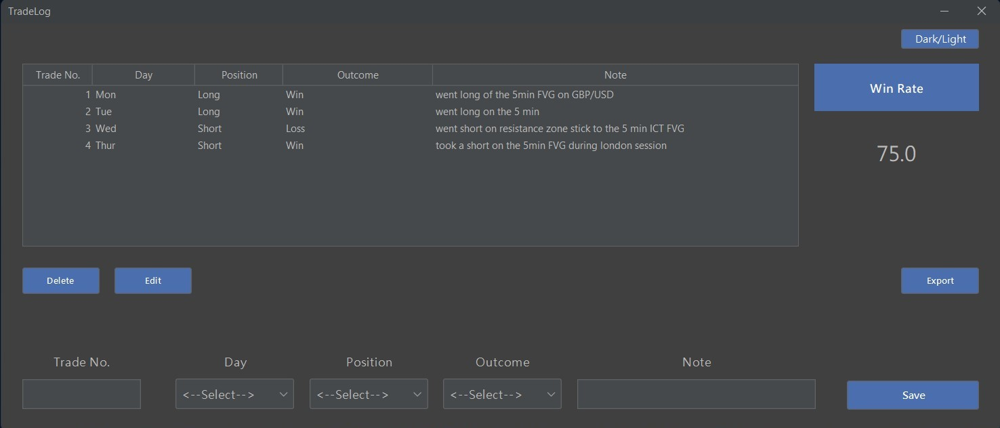
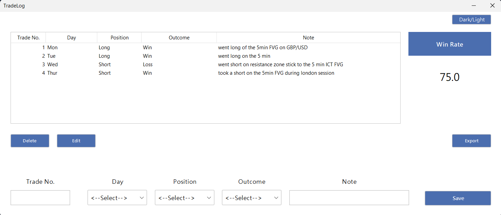

# TradeLog
This is a Java desktop application that helps traders track their trades.

## Design

## Tools used:
- MySQL
- Java Swing

## Features
TradeLog makes use of CRUD operations to allow the user to view and delete any information from the database, and help the user keep
track of their trades.

TradeLog also allows one to download their trade records as an Excel file.
